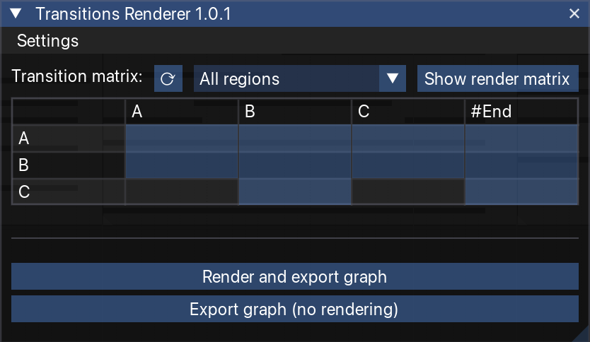

# A Reaper/FMOD Framework for Adaptive Music

A toolchain for composers and game audio designers to create adaptive music with horizontal re-sequencing directly within Reaper, and automatically export and assemble the corresponding FMOD project.

The framework consists of two components:
- **Reaper script** — automates asset rendering (including separated files with body and release tails for seamless transitions) and exports the transition graph.
- **FMOD script** — automatically generates an FMOD event embedding the horizontal re-sequencing logic from the generated assets and graph.
---

## Installation

### Reaper Script — TransitionsRenderer

1. Download the `TransitionsRenderer` folder from this repository.
2. Locate your Reaper Scripts folder by opening Reaper and navigating to **Options > Show REAPER resource path in Explorer/Finder**. Inside the opened folder, go to the `Scripts` subfolder.
3. Copy the `TransitionsRenderer` folder into that `Scripts` folder.
4. Back in Reaper, go to **Actions > Show action list**, click **ReaScript: Load**, and load the main script (Transitions Renderer v1.lua) from the folder.

### FMOD Script — TransitionsAssembler

1. Download `TransitionsAssembler.js` from this repository.
2. Copy it to the FMOD Studio scripts folder for your OS:
   - **Windows**: `%USERPROFILE%\Documents\FMOD Studio\Scripts\`
   - **macOS**: `~/Documents/FMOD Studio/Scripts/` or `~/Library/Preferences/FMOD Studio/Scripts/`
   - **Linux**: `~/Documents/FMOD Studio/Scripts/`

---

## Usage

A demonstration video is available [here](https://drive.google.com/file/d/1N2CV54FB5GoNftb0w1jMcDUh9MzEoQg6/view?usp=sharing).

### Reaper Script — TransitionsRenderer

The renderer is executed from **Actions > Show action list** by selecting the corresponding action (Transitions Renderer v1.lua), on a project containing the regions to be rendered.

<!---->

The GUI includes a transition graph matrix in the upper section, allowing users to specify the transition graph graphically. Users can choose to include all regions in the project or only those selected in the region render matrix. Once the transition graph is defined, the lower buttons enable users to either:
- **Render assets and export** the graph to a JSON file, or
- **Export the graph only** — useful when assets have already been rendered and only the graph needs to be updated.

The **Settings** menu provides configuration options:
- Output path and JSON filename (relative to the media files project path)
- Suffixes for asset naming
- Maximum render tail duration
- Whether to expand default edges
- Whether to work on a project copy (to avoid accidental changes to the original project)
<!-- Este texto no aparece en la preview 
- Trailing silence threshold
- Whether to include assets in auxiliary tracks
-->

### FMOD Script — TransitionsAssembler

On an empty FMOD project, run the script from **Scripts > TransitionsAssembler** and provide the path (ending with ´/´) of the generated assets folder. The script will automatically generate a complete event containing:
- All music regions as timeline segments
- The transition logic between regions
- A labeled parameter driving the region switching

The event is immediately ready for integration into the game engine.

> **Note:** Region parameter labels may appear overlapped in the FMOD UI — this is a display issue only and does not affect functionality.

---

## Citation

> _Citation coming soon._